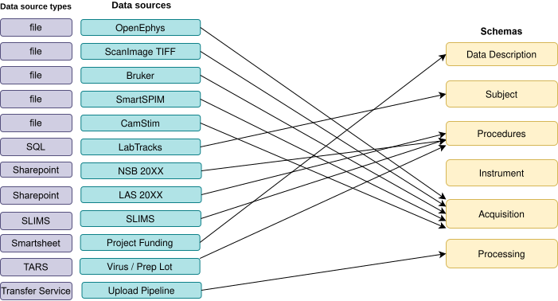
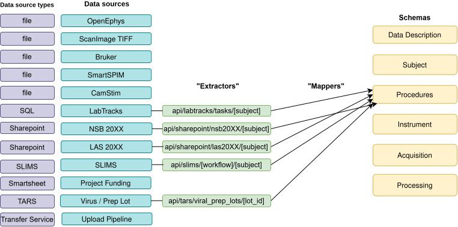
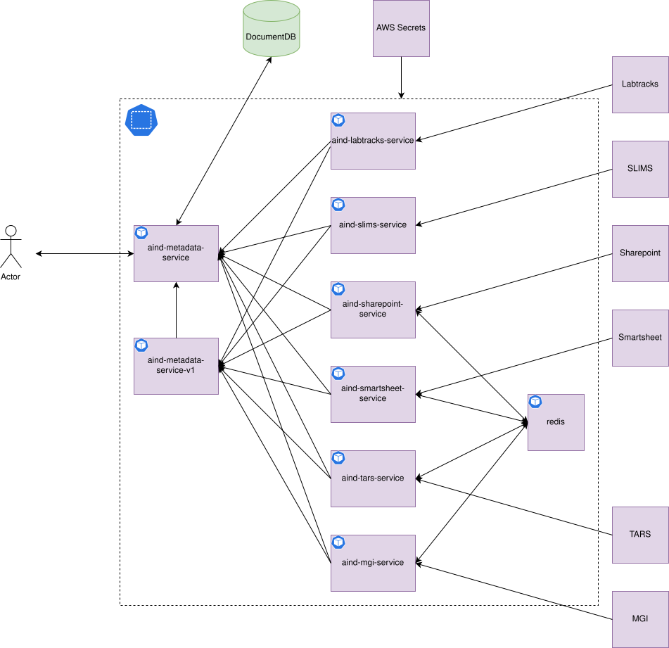

Architecture
============

Overview
--------

The Metadata Service is a FastAPI REST service that aggregates metadata
from multiple specialized microservices and returns validated Pydantic models —
primarily `aind-data-schema <https://github.com/AllenNeuralDynamics/aind-data-schema>`_
models. Instead of one monolithic backend, each data source has its own
dedicated containerized microservice. The main service calls those clients,
optionally transforms the responses through mapper modules, and returns a
validated JSON response.

.. Diagrams are sourced from the central AIND design/architecture repo.
.. To update, export the updated SVG from that repo and replace the file in docs/diagrams/.

Request Lifecycle
-----------------

A typical request flows through these layers:

1. **Client** sends a request — e.g. ``GET /api/v2/procedures/{subject_id}``
2. **FastAPI router** (``routes/procedures.py``) receives the request and injects
   the relevant async client sessions via FastAPI dependency injection.
3. **Route handler** calls one or more backend microservice clients concurrently.
4. **Mapper** (``mappers/procedures.py``) receives the raw backend payloads and
   constructs the corresponding ``aind-data-schema`` Pydantic model.
5. **Response** is serialized to JSON and returned to the caller.

If any backend returns an error, the mapper handles the partial response
gracefully and the route returns an appropriate HTTP status code.

Data Sources
------------

Each data source runs as its own microservice. The main service installs the
corresponding async client package as a dependency. Here is a summary of the data sources and their respective microservices:

.. list-table::
   :header-rows: 1
   :widths: 14 38 24 24

   * - Data Source
     - What It Provides
     - Microservice Repository
     - Async Client (PyPI)
   * - LabTracks
     - Mouse colony records — subject demographics, genotype, sex, date of birth
     - `aind-labtracks-service <https://github.com/AllenNeuralDynamics/aind-labtracks-service>`__
     - ``aind-labtracks-service-async-client``
   * - MGI
     - Mouse Genome Informatics allele data for transgenic lines
     - `aind-mgi-service <https://github.com/AllenNeuralDynamics/aind-mgi-service>`__
     - ``aind-mgi-service-async-client``
   * - Smartsheet
     - Funding records, project investigators, protocols, exaSPIM procedures
     - `aind-smartsheet-service <https://github.com/AllenNeuralDynamics/aind-smartsheet-service>`__
     - ``aind-smartsheet-service-async-client``
   * - SharePoint
     - Neurosurgery and behavior procedure records
     - `aind-sharepoint-service <https://github.com/AllenNeuralDynamics/aind-sharepoint-service>`__
     - ``aind-sharepoint-service-async-client``
   * - TARS
     - Viral injection material lot records
     - `aind-tars-service <https://github.com/AllenNeuralDynamics/aind-tars-service>`__
     - ``aind-tars-service-async-client``
   * - Session JSON
     - Session-level metadata for data assets
     - `aind-session-json-service <https://github.com/AllenNeuralDynamics/aind-session-json-service>`__
     - ``aind-session-json-service-async-client``
   * - Dataverse
     - Microsoft Dynamics 365 — mouse weight records
     - `aind-dataverse-service <https://github.com/AllenNeuralDynamics/aind-dataverse-service>`__
     - ``aind-dataverse-service-async-client``
   * - Active Directory
     - User email lookup by username
     - `aind-active-directory-service <https://github.com/AllenNeuralDynamics/aind-active-directory-service>`__
     - ``aind-active-directory-service-async-client``
   * - DocDB (MongoDB)
     - Instrument and rig configuration documents
     - `aind-data-access-api <https://github.com/AllenNeuralDynamics/aind-data-access-api>`__
     - ``aind-data-access-api``

API Endpoints
-------------

Right now, the service is supporting both v1 and v2 of the aind-data-schema.
A full interactive API reference (Swagger UI) is available at ``/docs``. 
All paths that are prefixed with ``/api/v2/`` are the v2 endpoints. 

Kubernetes Deployment
---------------------

In production, the service and all its backend microservices run as pods in a
Kubernetes cluster. The diagram below shows the deployment topology:

Clients
-------

Two auto-generated Python client libraries are published to PyPI for consuming
the service:

* **Sync client** — ``pip install aind-metadata-service-client``
  Uses ``urllib3`` under the hood; suitable for scripts and notebooks.

* **Async client** — ``pip install aind-metadata-service-async-client``
  Uses ``aiohttp``; suitable for async applications.

Both clients are regenerated from the OpenAPI spec (``openapi.json``) using
`OpenAPI Generator <https://openapi-generator.tech/>`_ whenever a new version
is released. The spec is produced by ``scripts/generate_openapi.py``.

Deprecation Notices
-------------------

.. warning::

   **SLIMS Integration Disabled (2026-08-19)**

   The SLIMS data provider has been shut down. The following have been removed:

   * SLIMS API workflow endpoints (``/api/v2/slims/*``)
   * SLIMS-based procedures and specimen procedure mapping
   * SLIMS rig/instrument data — instruments now fetch exclusively from DocDB
